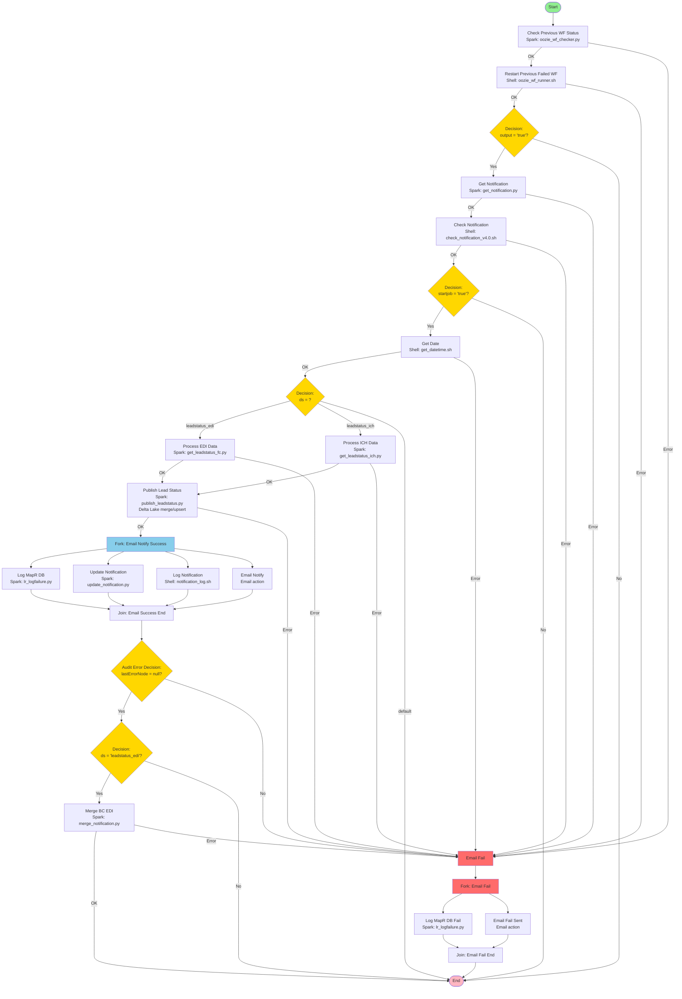

# Lead Status Upsert - Hadoop Workflow Flow Diagram

## Hadoop Workflow: leadstatus: upsert



## Text-Based Flow Diagram

```
┌─────────────────────────────┐
│   Start                     │
└──────────┬──────────────────┘
           │
           ▼
┌─────────────────────────────┐
│ Check Previous WF Status    │
│ (Spark - oozie_wf_checker.py│
│  check for failed workflows)│
└──────────┬──────────────────┘
           │
           ├──────────────────┐
           │                  │
           ▼                  ▼
┌─────────────┐    ┌─────────────┐
│ Restart     │    │ Email Fail  │
│ Previous    │    │             │
│ Failed WF   │    └─────────────┘
│ (Shell)     │
└──────┬──────┘
       │
       ▼
┌─────────────────────────────┐
│ Decision: output = 'true'?  │
└──────────┬──────────────────┘
           │
           ├──────────────────┐
           │                  │
           ▼                  ▼
┌─────────────┐    ┌─────────────┐
│ Get         │    │ End         │
│ Notification│    │             │
│ (Spark)     │    └─────────────┘
└──────┬──────┘
       │
       ├──────────────────┐
       │                  │
       ▼                  ▼
┌─────────────┐    ┌─────────────┐
│ Check       │    │ Email Fail  │
│ Notification│    │             │
│ (Shell)     │    └─────────────┘
└──────┬──────┘
       │
       ▼
┌─────────────────────────────┐
│ Decision: startjob = 'true'?│
└──────────┬──────────────────┘
           │
           ├──────────────────┐
           │                  │
           ▼                  ▼
┌─────────────┐    ┌─────────────┐
│ Get Date    │    │ End         │
│ (Shell)     │    │             │
└──────┬──────┘    └─────────────┘
       │
       ├──────────────────┐
       │                  │
       ▼                  ▼
┌─────────────┐    ┌─────────────┐
│ Decision:   │    │ Email Fail  │
│ ds = ?      │    │             │
└──────┬──────┘    └─────────────┘
       │
       ├──────────────┬──────────────┐
       │              │              │
       ▼              ▼              ▼
┌─────────────┐  ┌─────────────┐  ┌─────────────┐
│ Process     │  │ Process     │  │ End         │
│ EDI Data    │  │ ICH Data    │  │ (default)   │
│ (Spark)     │  │ (Spark)     │  │             │
└──────┬──────┘  └──────┬───────┘  └─────────────┘
       │                │
       └────────┬───────┘
                │
                ▼
       ┌─────────────────────────────┐
       │ Publish Lead Status         │
       │ (Spark - publish_leadstatus │
       │  Delta Lake merge/upsert)   │
       └──────┬──────────────────┘
              │
              ├──────────────────┐
              │                  │
              ▼                  ▼
       ┌─────────────┐    ┌─────────────┐
       │ Fork: Email │    │ Email Fail  │
       │ Notify       │    │             │
       │ Success      │    └─────────────┘
       └──────┬───────┘
              │
              ├──────────┬──────────┬──────────┐
              │          │          │          │
              ▼          ▼          ▼          ▼
       ┌──────────┐ ┌──────────┐ ┌──────────┐ ┌──────────┐
       │ Log      │ │ Update   │ │ Log      │ │ Email    │
       │ MapR DB  │ │ Notification│ Notification│ Notify   │
       │ (Spark)  │ │ (Spark)  │ │ (Shell)  │ │ (Email)  │
       └────┬─────┘ └────┬─────┘ └────┬─────┘ └────┬─────┘
            │            │            │            │
            └────────────┴────────────┴────────────┘
                          │
                          ▼
                 ┌─────────────────────────────┐
                 │ Join: Email Success End     │
                 └──────┬──────────────────┘
                        │
                        ▼
                 ┌─────────────────────────────┐
                 │ Audit Error Decision:       │
                 │ lastErrorNode = null?        │
                 └──────┬──────────────────┘
                        │
                        ├──────────────────┐
                        │                  │
                        ▼                  ▼
                 ┌─────────────┐    ┌─────────────┐
                 │ Decision:   │    │ Email Fail  │
                 │ ds = 'leadstatus_edi'?│             │
                 └──────┬──────┘    └─────────────┘
                        │
                        ├──────────────────┐
                        │                  │
                        ▼                  ▼
                 ┌─────────────┐    ┌─────────────┐
                 │ Merge BC EDI │    │ End         │
                 │ (Spark)      │    │             │
                 └──────┬───────┘    └─────────────┘
                        │
                        ├──────────────────┐
                        │                  │
                        ▼                  ▼
                 ┌─────────────┐    ┌─────────────┐
                 │ End         │    │ Email Fail  │
                 │             │    │             │
                 └─────────────┘    └──────┬──────┘
                                            │
                                            ▼
                                   ┌─────────────────────────────┐
                                   │ Fork: Email Fail           │
                                   └──────┬──────────────────┘
                                          │
                                          ├──────────┐
                                          │          │
                                          ▼          ▼
                                   ┌──────────┐ ┌──────────┐
                                   │ Log      │ │ Email    │
                                   │ MapR DB  │ │ Fail     │
                                   │ Fail     │ │ Sent     │
                                   │ (Spark)  │ │ (Email)  │
                                   └────┬─────┘ └────┬─────┘
                                        │            │
                                        └──────┬─────┘
                                               │
                                               ▼
                                      ┌─────────────────────────────┐
                                      │ Join: Email Fail End      │
                                      └──────┬──────────────────┘
                                             │
                                             ▼
                                      ┌─────────────────────────────┐
                                      │ End                         │
                                      └─────────────────────────────┘
```

## Key Process Steps

1. **Check Previous WF Status** - Spark job to check for previously failed workflows in MapR DB
2. **Restart Previous Failed WF** - Shell script to restart any failed workflows found
3. **Decision: Oozie Runner** - If restart was needed (output='true'), continue; otherwise end
4. **Get Notification** - Spark job to retrieve notification from MapR DB
5. **Check Notification** - Shell script to validate notification and extract metadata (ds, date, bc, etc.)
6. **Decision: Start Job** - If notification is valid (startjob='true'), continue; otherwise end
7. **Get Date** - Shell script to format breadcrumb date
8. **Decision: Data Source** - Branch based on dataset type:
   - **leadstatus_edi** → Process EDI Data
   - **leadstatus_ich** → Process ICH Data
   - **default** → End
9. **Process EDI Data** - Spark job (get_leadstatus_fc.py) to process EDI lead status data:
   - Reads EDI queries and hits/misses
   - Processes lead status updates
   - Writes to scratch path
10. **Process ICH Data** - Spark job (get_leadstatus_ich.py) to process ICH lead status data:
    - Reads ICH EB segment, LR transaction, and parsed data
    - Processes lead status updates
    - Writes to scratch path
11. **Publish Lead Status** - Spark job (publish_leadstatus.py) to publish/upsert lead status:
    - Reads processed data from scratch path
    - Performs Delta Lake merge/upsert operations
    - Updates lead status in publish path
12. **Fork: Email Notify Success** - Parallel execution of:
    - **Log MapR DB** - Log workflow completion to MapR DB
    - **Update Notification** - Update notification status in MapR DB
    - **Log Notification** - Log notification to HDFS
    - **Email Notify** - Send success email notification
13. **Join: Email Success End** - Wait for all parallel paths to complete
14. **Audit Error Decision** - Check if any errors occurred during parallel execution
15. **Decision: Merge BC EDI** - If dataset is 'leadstatus_edi', merge notification; otherwise end
16. **Merge BC EDI** - Spark job to merge breadcrumb for EDI notifications
17. **Fork: Email Fail** - On any error, parallel execution of:
    - **Log MapR DB Fail** - Log failure to MapR DB
    - **Email Fail Sent** - Send failure email notification
18. **Join: Email Fail End** - Wait for error handling paths to complete
19. **End** - Workflow completion

## Key Features

- **Error Recovery**: Checks and restarts previously failed workflows
- **Notification-Based**: Uses MapR DB notifications to trigger processing
- **Multi-Source Support**: Handles both EDI and ICH data sources
- **Delta Lake Upsert**: Uses Delta Lake merge operations for lead status updates
- **Parallel Logging**: Fork/join pattern for parallel logging and notifications
- **Error Handling**: Comprehensive error logging and email notifications
- **Conditional Processing**: Multiple decision nodes for workflow control
